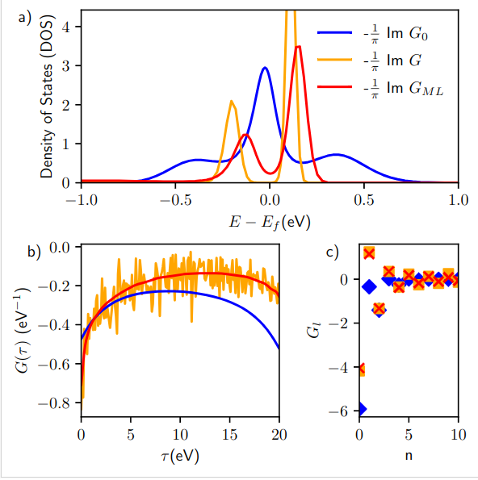

<!-- ABOUT THE PROJECT -->
## About The Project

This tool is designed to predict interacting Green functions by noninteracting ones.  
One can build a database of Green's functions, train different models and use them to predict G, obtain density of states. 

<p align="right">(<a href="#readme-top">back to top</a>)</p>

### Prerequisites

* triqs_cthyb
  ```sh
  mamba install conda-forge::triqs_cthyb
  ```
 * triqs
  ```sh
  mamba install -c conda-forge triqs
  ```
 * PyTorch
   ```sh
   conda create --name triqs python pytorch cpuonly -c pytorch
   ```
 * triqs-maxent
  ```sh
  pip install triqs-maxent
  ```
<p align="right">(<a href="#readme-top">back to top</a>)</p>
 
<!-- USAGE EXAMPLES -->
## Usage

Notebooks:
* *sample_analize *:Plot G, G_0 and other features of single sample
* *gf2ML*: Build, calculate and plot samples from the database
* *train_model*: Train ML model to predict G by G_0 




<p align="right">(<a href="#readme-top">back to top</a>)</p>

<!-- CONTACT -->
## Contact

Egor Agapov -  agapov.em@phystech.edu

Project Link: [https://github.com/EgorcaA/gf2ML](https://github.com/EgorcaA/gf2ML)
<p align="right">(<a href="#readme-top">back to top</a>)</p>
 
